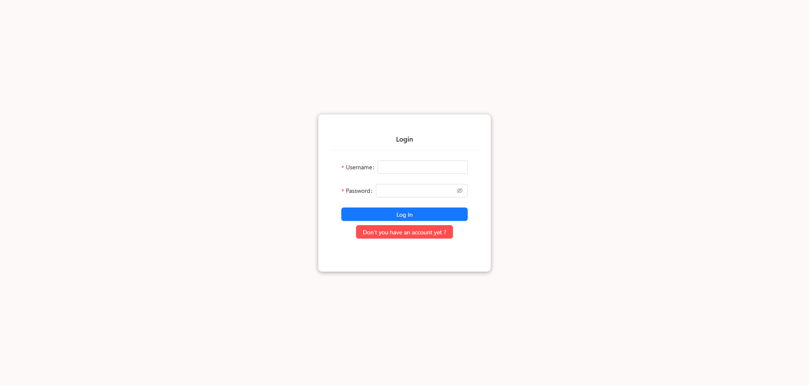
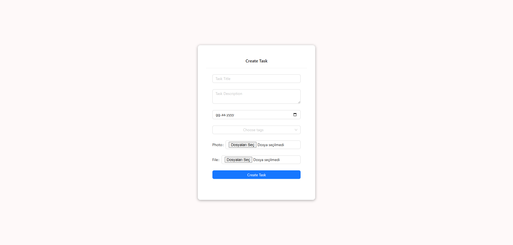

# 🤖 ToDo App with AI

ToDo App with AI is a full-stack task management application enhanced with **OpenAI integration**.  
It allows users to create and manage their tasks while receiving intelligent suggestions powered by GPT.  
This application is ideal for personal productivity and task planning, with a clean UI and secure authentication system.

---

## 🚀 Features

- 🔐 User **authentication** using JWT (Register/Login)
- 🛡️ **Form validations** for better user experience
- 🤖 **AI-generated task suggestions** via OpenAI
- 📝 Create, read, update, and delete tasks (CRUD)
- ✅ Mark tasks as completed and update them
- 🌐 Responsive and modern user interface

---

## 🛠️ Tech Stack

| Layer         | Technologies                                      |
|---------------|---------------------------------------------------|
| Frontend      | HTML, CSS, JavaScript , React , Redux ,antd       |
| Backend       | Node.js, Express.js                               |
| Authentication| JWT (JSON Web Tokens)                             |
| AI Integration| OpenAI GPT API                                    |
| Database      | MongoDB with Mongoose                             |
| Tools         | Postman, Git, GitHub, VS Code                     |

---

## 📷 Screenshots

### 🔐 Login


### 📝 Register


### 📋 Task List


### ➕ Create Task (AI Suggestion)


### ✏️ Update Task (Mark as Completed)


---

## 📦 Getting Started

Clone the repository:

```bash
git clone https://github.com/kuyucucaner/todo-app-with-ai.git
cd todo-app-with-ai
cd server / npm install
cd client / npm install

---

## 🛡️ Environment Variables

PORT=5000
MONGO_URI=your_mongodb_connection_string
JWT_SECRET=your_jwt_secret
OPENAI_KEY=your_openai_api_key

---

## ▶️ Run the App
C:\Users\user\Projects\todo-app-with-ai> npm start 
